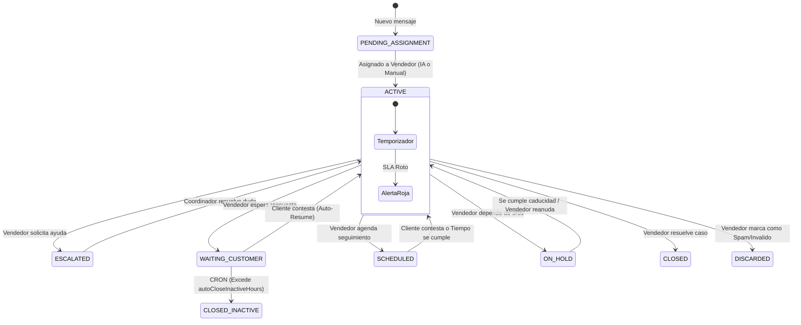

# Ciclo de Vida de las Conversaciones y Sistema SLA

Este documento técnico detalla los estados avanzados por los que atraviesa una conversación en el sistema **Salesflow (BMAD Multichannel)** y cómo se regulan los Acuerdos de Nivel de Servicio (SLA) para proteger las métricas y evitar fraudes operativos.

## 1. Diagrama de Flujo del Ticket y SLA

## 2. El Universo del Ticket: Estados y Reglas de Negocio

### Estados Operativos (Consumen SLA)
- **`PENDING_ASSIGNMENT` (Pendiente de Asignación)**
  - Ocurre al recibir el primer mensaje.
  - El SLA de "Primera Respuesta" cuenta desde la apertura del horario comercial.
- **`ACTIVE` (Activo)**
  - Ocurre cuando un asesor toma el chat. 
  - El SLA de "Resolución" avanza. 
- **`ESCALATED` (Escalado)**
  - El vendedor solicita intervención de un gerente. El SLA no se detiene (responsabilidad compartida).

### Estados de Pausa (Congelan SLA temporalmente)
- **`WAITING_CUSTOMER` (Esperando al Cliente)**
  - **Regla de Bloqueo UI/Backend:** Solo se puede activar si el *último mensaje* en la conversación fue enviado por el Vendedor. 
  - **Auto-reanudación:** Si el cliente responde, el estado regresa forzosamente a `ACTIVE` de inmediato.
- **`SCHEDULED` (Seguimiento Programado)**
  - **Regla de Bloqueo:** Misma que `WAITING_CUSTOMER`. Requiere que el vendedor establezca una fecha/hora de seguimiento.
  - **Auto-reanudación:** El sistema lo devuelve a `ACTIVE` al cumplirse el plazo o si el cliente escribe antes.
- **`ON_HOLD` (En Espera de Terceros / Proveedores)**
  - **Anti-Abuso 1 (Auditoría):** Obliga al asesor a tipificar la razón y nota explicativa antes de permitir el cambio.
  - **Anti-Abuso 2 (Timebomb):** Requiere un límite máximo de horas (Timebomb). Al expirar, regresa violentamente a `ACTIVE`.
  - **Métrica Supervisada:** El tiempo en Hold es promediado en el Dashboard del Coordinador para identificar a vendedores que evaden el SLA.

### Estados Terminales (Cierre definitivo)
- **`CLOSED` (Cerrado Exitoso)**
  - Atención exitosa. Suma positivamente a la productividad.
- **`CLOSED_INACTIVE` (Cierre por Inactividad)**
  - Acción automatizada. Un Cronjob nocturno evalúa los tickets en `WAITING_CUSTOMER`. Si exceden las `autoCloseInactiveHours` configuradas a nivel `Tenant`, los cierra. Separa los fantasmas de las ventas reales.
- **`DISCARDED` (Spam / Inválido)**
  - Se descarta de inmediato para bots, trolls o números equivocados. Excluido permanentemente del motor de métricas de resolución para no inflar los KPIs.

## 3. Disponibilidad del Agente vs SLA del Ticket
**Concepto Fundamental:** La disponibilidad del Agente (*Online, Ausente/Baño, Comida*) funciona de forma independiente a los tickets.
- Ponerse en **"Ausente" (Away)** le indica al motor de enrutamiento que no asigne **nuevos** chats al vendedor.
- **Excepción Crítica:** Ponerse "Ausente" **NO** pausa los SLAs de los tickets `ACTIVE` que el vendedor ya tiene asignados. Los descansos deben gestionarse administrando las cargas urgentes.

## 4. Configuración (Tenant-Level) y Feature Flags
Como plataforma SaaS multitenant, reconocemos que no todas las empresas requieren la rigurosidad de un Contact Center. Para evitar imponer camisas de fuerza operativas, el motor de ciclo de vida cuenta con un **Interruptor Maestro**:

- **`isSlaEnabled` (Toggle ON/OFF)**
  - **Modo Avanzado (ON):** Habilita todo este documento. Se encienden los temporizadores, los bordes rojos/naranjas, las reglas anti-abuso del `ON_HOLD`, las alertas de colisión y el Cronjob de inactividad. Ideal para corporativos y Call Centers.
  - **Modo Simple (OFF):** Apaga por completo el motor de SLA. Las conversaciones solo fluyen entre `PENDING_ASSIGNMENT`, `ACTIVE` y `CLOSED`. Desaparecen los cronómetros visuales y las validaciones estrictas de "quién mandó el último mensaje". Ideal para PyMEs o negocios con flujos de atención informales.

- `autoCloseInactiveHours`: Límite de horas (default: 48h) de paciencia que tiene la empresa antes de declarar muerto (CLOSED_INACTIVE) un ticket (Aplica en Modo Avanzado).
- `businessHours`: Matriz de horarios laborales para ignorar el conteo de SLA fuera del horario comercial (Aplica en Modo Avanzado).
